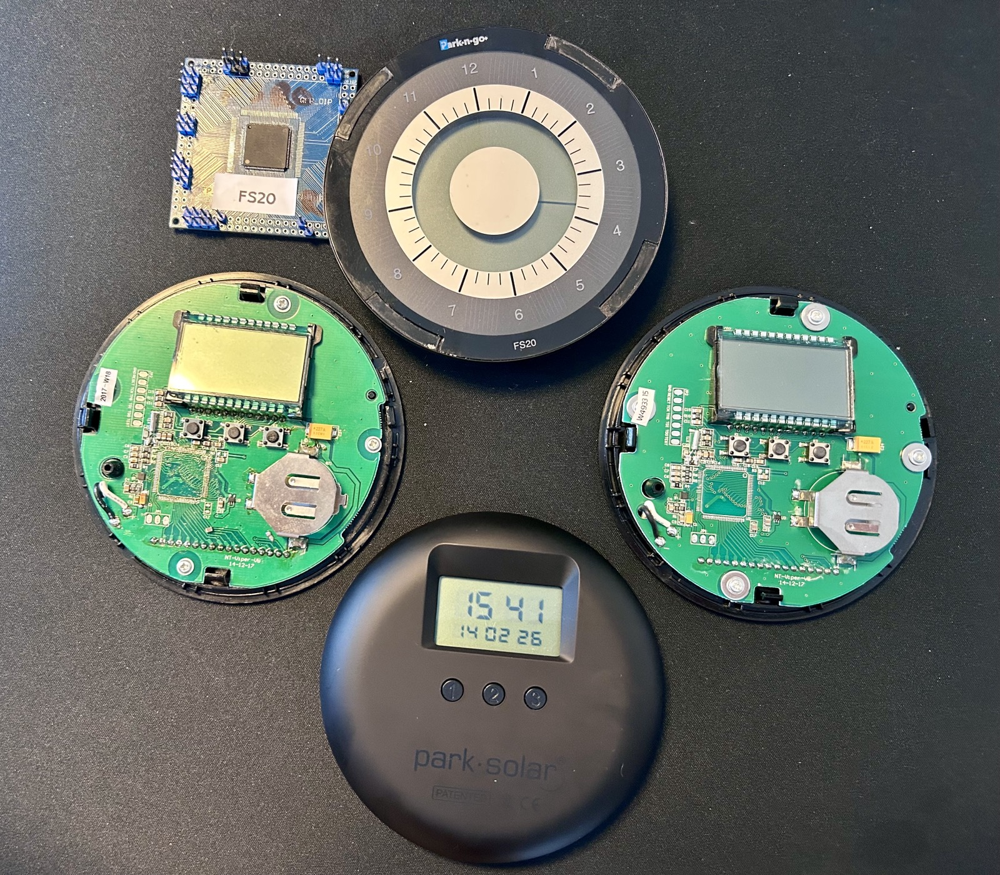
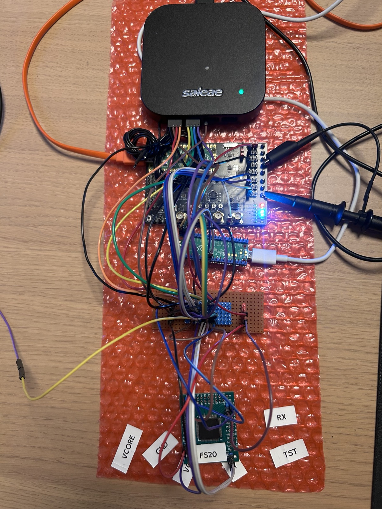
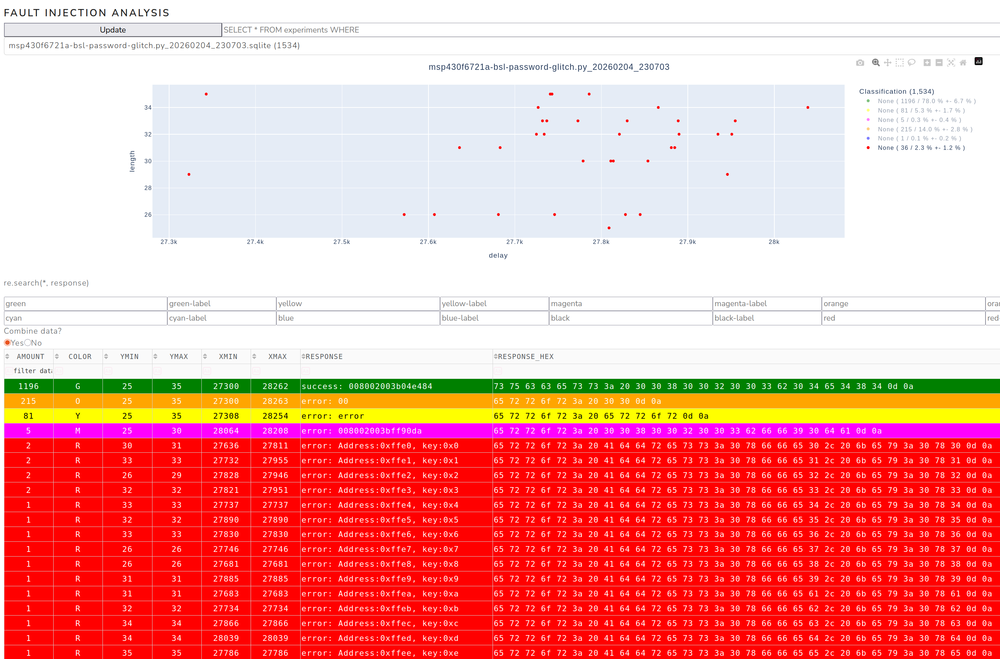
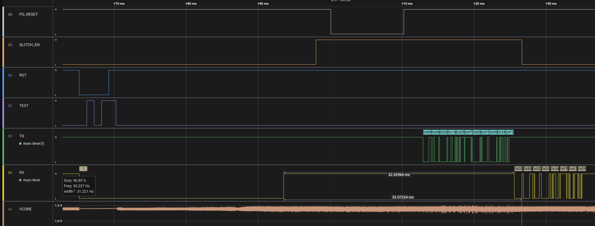
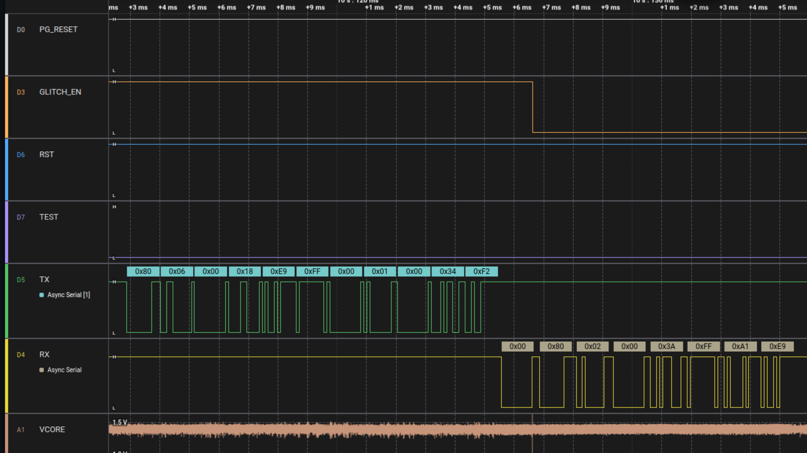

# ParkOne park·n·go FS20 - Firmware Dump & Fault Injection Research

Firmware extraction and analysis of the **ParkOne park·n·go FS20** parking clock.

---

## 📖 Preface

The ParkOne FS20 parking clock is built around the MSP430F6721A microcontroller.

This MCU:

* Stores and executes the device firmware
* Exposes a JTAG interface for debugging and programming
* Supports permanent JTAG locking to prevent firmware extraction

While the JTAG interface is typically enabled during development, it can be permanently disabled as a security measure. Earlier versions of this product did not properly lock JTAG, which allowed trivial firmware extraction (see my previous research project: [ParkOne](https://github.com/BenjaminSoelberg/ParkOne)).

This repository documents the extraction of firmware from a properly locked device using fault injection techniques.

---

## 🎯 Project Goal

Extract the firmware from a JTAG-locked MSP430F6721A using voltage glitching and fault injection.

> ⏱ Research duration: **~4 months**

---

## The victims

---

## 📦 Firmware Dump

Extracted firmware files:

* [`fs20-firmware-dump.txt`](fs20-firmware-dump.txt) - Human-readable hex dump
* [`fs20-firmware-dump.bin`](fs20-firmware-dump.bin) - Raw binary dump

---

## ⚡ Dumping Setup - Pico Glitcher Fault Injection

Firmware extraction was performed using the Pico Glitcher (v2.4).

Glitching was used to bypass protection mechanisms and gain access to restricted memory regions.

Additional tools:

* Saleae Logic Analyzer - For signal analysis
* Rasberry Pi Pico Trigger board - handles timing and communication with the target
* Custom switch board - poor mans bread board
* Breakout board - with the MSP430F6721A target

---

## 🔬 Fault Injection Setup

### Hardware Setup

**Logic alyzer, Rasberry Pi Pico Trigger board, switch board  &  MSP430F6721A board**

---

## Successful Glitch Examples

### A graph view of successful glitches

### A Saleae logic analyzer view of successful glitches

### A zoomed-in Saleae logic analyzer view of a single successful glitch

---

## 🧠 BSL (Bootstrap loader) Analysis

BSL version: **00-07-05-04**

Memory region: `0x1000 - 0x17FF`

---

### 🔹 Original BSL

[`bsl-00-07-05-04-msp430f6721a.bin`](bsl/bsl-00-07-05-04-msp430f6721a.bin)

This is the starting point for the authentication and protection research.

---

### 🔹 Patched BSL (Authentication Visibility)

[`bsl-00-07-05-04-msp430f6721a-patched.bin`](bsl/bsl-00-07-05-04-msp430f6721a-patched.bin)

Modifications:

* Toggles the TX pin **before and after** the authentication check
* Allows visual confirmation of authentication timing via a logic analyzer

---

### 🔹 No-Auth Patched BSL (Bypass Version)

[`bsl-00-07-05-04-msp430f6721a-patched-no-auth.bin`](bsl/bsl-00-07-05-04-msp430f6721a-patched-no-auth.bin)

Modifications:

* Disables the authentication logic
* Toggles TX pin before and after the (removed) check

---

## 🛠 Techniques Used

* Voltage glitching using Pico Glitcher v2.4
* Timing-based fault injection using Rasberry Pi Pico
* Logic analyzer signal inspection using Saleae Pro 16
* BSL reverse engineering using Ghidra
* Firmware patching using Ghidra and a simple hex editor

---

## ⚠️ Disclaimer

This repository is published for:

* Security research
* Embedded systems education
* Demonstrating the importance of hardware security

Do not use these techniques on devices you do not own or have permission to analyze.

